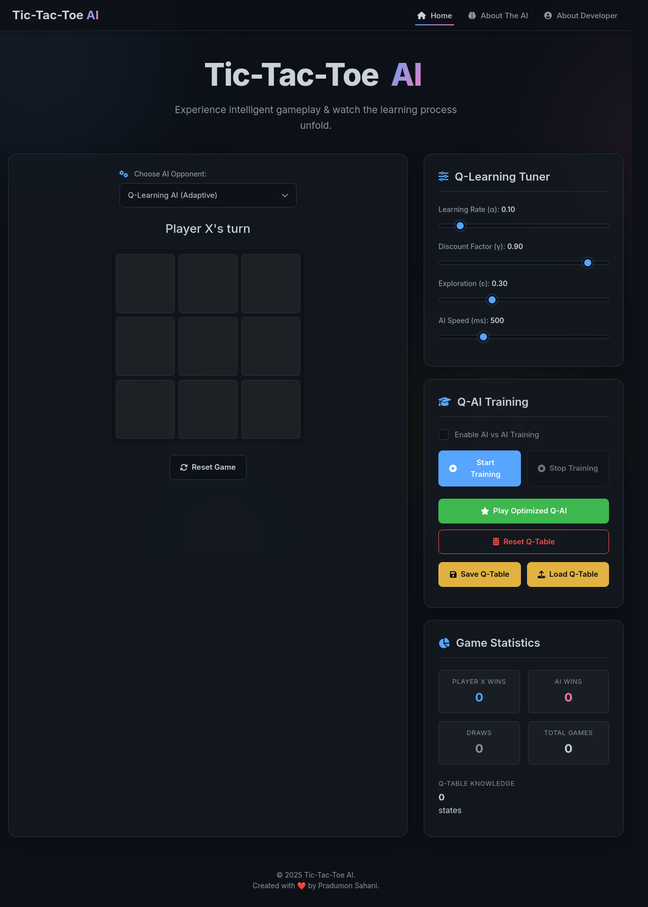

# Tic-Tac-Toe AI 🎮🧠

Welcome to the Tic-Tac-Toe AI project! This interactive web application allows you to play the classic game of Tic-Tac-Toe against two different types of Artificial Intelligence: a Q-Learning agent that learns from experience, and an optimal Minimax agent. You can also observe the Q-Learning AI train itself by playing against a random opponent.

**Live Demo:**
[https://tic-tac-toe-ai-mauve.vercel.app](https://tic-tac-toe-ai-mauve.vercel.app)




## Table of Contents
- [Features](#features)
- [AI Agents Explained](#ai-agents-explained)
- [Technologies Used](#technologies-used)
- [Project Structure](#project-structure)
- [Getting Started](#getting-started)
  - [Prerequisites](#prerequisites)
  - [Running Locally](#running-locally)
- [How to Play & Use](#how-to-play--use)
- [About The Developer](#about-the-developer)
- [Future Enhancements](#future-enhancements)
- [License](#license)

## Features ✨

* **Dual AI Opponents:**
    * **Q-Learning AI:** An adaptive AI that learns to play through reinforcement learning. Its strategy improves over time with training.
    * **Minimax AI:** A classic game theory AI that plays Tic-Tac-Toe optimally. It will always win or draw if possible.
* **Interactive Gameplay:** Play directly against the selected AI.
* **AI Selection:** Easily switch between the Q-Learning and Minimax AI opponents.
* **Q-Learning AI Training Mode:** Watch the Q-Learning AI train itself by playing against a random agent. Observe its exploration rate (ε) decay and Q-Table grow.
* **Hyperparameter Tuning (Q-Learning):**
    * Adjust Learning Rate (α)
    * Adjust Discount Factor (γ)
    * Adjust Exploration Rate (ε)
    * Control AI thinking speed (visual delay)
* **Play Optimized Q-AI:** Challenge the Q-Learning AI after it has been trained, with a very low exploration rate.
* **Save/Load Q-Table:** Persist the Q-Learning AI's learned knowledge (its "brain") to a JSON file and load it back later.
* **Reset Q-Table:** Start the Q-Learning AI's training from scratch.
* **Game Statistics:** Track wins for Player X, AI wins, draws, and total games played.
* **Modern & Responsive UI:** A sleek "Aurora" themed interface that adapts to different screen sizes.
* **Navigation Menu:** Easy access to Home, About The AI, and About Developer pages.
* **Detailed Documentation Pages:**
    * `about-ai.html`: In-depth explanation of how the Q-Learning and Minimax algorithms work in this context.
    * `about-me.html`: Information about the project developer.

## AI Agents Explained 🤖

This project implements two distinct AI agents:

1.  **Q-Learning Agent:**
    * Based on **Reinforcement Learning**.
    * Learns by interacting with the environment (playing the game) and receiving rewards or penalties for its actions.
    * Maintains a **Q-Table** to store the "quality" of taking a specific action in a given game state.
    * Uses an **epsilon-greedy strategy** to balance exploration (trying new moves) and exploitation (using known good moves).
    * Its performance improves with more training games.
    * For a detailed explanation, please see the [About The AI page](about-ai.html).

2.  **Minimax Agent:**
    * Based on **Game Theory**.
    * Assumes the opponent will also play optimally.
    * Explores the game tree to find the move that maximizes its potential score while minimizing the opponent's maximum score.
    * Plays Tic-Tac-Toe perfectly (will always win or draw if possible).
    * Does not require "training" in the same way as Q-Learning.
    * For a detailed explanation, please see the [About The AI page](about-ai.html).

## Technologies Used 💻

* **HTML5:** For the structure of the web application.
* **CSS3:** For styling the user interface.
    * Custom CSS for the "Aurora" theme, responsiveness, and component styling.
    * **Tailwind CSS:** Utilized for utility classes to speed up development.
* **JavaScript (ES6+):** For all game logic, AI algorithms, and UI interactivity.
    * Game Core Logic (`tic-tac-toe.js`)
    * Q-Learning AI (`q-learning-ttt.js`)
    * Minimax AI (`minimax-ai-ttt.js`)
    * UI Controller (`ui-controller.js`)
* **Font Awesome:** For icons.
* **Google Fonts (Inter):** For typography.

## Project Structure 📁

tic-tac-toe-ai/ <br> 
├── index.html              # Main game page <br>
├── about-ai.html           # Documentation about the AI <br>
├── about-me.html           # Information about the developer <br>
├── style.css               # Main stylesheet for the Aurora UI <br>
├── tic-tac-toe.js          # Core game logic <br>
├── q-learning-ttt.js       # Q-Learning AI implementation <br>
├── minimax-ai-ttt.js       # Minimax AI implementation <br>
├── ui-controller.js        # Handles UI interactions and game flow <br>
├── LICENSE                 # Project license  <br>
└── README.md               # This file <br>
## Getting Started 🚀

### Prerequisites

* A modern web browser (e.g., Chrome, Firefox, Edge, Safari).
* No external dependencies or build steps are required to run this project locally, as it uses plain HTML, CSS, and JavaScript with CDN links for external libraries (Tailwind, Font Awesome).

### Running Locally

1.  **Clone the repository (or download the files):**
    ```bash
    git clone https://github.com/pradumon14/tic-tac-toe-ai.git
    cd tic-tac-toe-ai
    ```

2.  **Open `index.html` in your browser:**
    * Navigate to the project directory in your file explorer.
    * Double-click the `index.html` file. It should open in your default web browser.

    Alternatively, you can use a simple HTTP server (like Python's built-in server or VS Code's Live Server extension) for a more robust local development experience, although it's not strictly necessary for this project.
    * Using Python's HTTP server (if Python is installed):
        ```bash
        # Python 3
        python -m http.server
        ```
        Then open `http://localhost:8000` in your browser.

## How to Play & Use 📖

1.  **Visit the Live Demo:** [https://tic-tac-toe-ai-mauve.vercel.app](https://tic-tac-toe-ai-mauve.vercel.app) or open `index.html` locally.
2.  **Choose AI Opponent:** Use the dropdown menu at the top of the game area to select either the "Q-Learning AI" or the "Minimax AI".
3.  **Game Play:**
    * Player X (Human) always starts.
    * Click on an empty cell on the board to make your move.
    * The selected AI (Player O) will then make its move.
    * The game status (whose turn it is, win/loss/draw) is displayed above the board.
4.  **Q-Learning AI Specifics:**
    * **Tuning:** If Q-Learning AI is selected, you can adjust its Learning Rate, Discount Factor, Exploration Rate, and Thinking Speed using the sliders in the "Q-Learning Tuner" card.
    * **Training:**
        * Check the "Enable AI vs AI Training" box.
        * Click "Start Training". The Q-AI will play against a random agent.
        * Click "Stop Training" to halt the process.
    * **Play Optimized:** Click "Play Optimized Q-AI" to play against the Q-Learning agent with a very low exploration rate (it will mostly use what it has learned).
    * **Q-Table Management:**
        * "Reset Q-Table": Clears all learned knowledge.
        * "Save Q-Table": Downloads the current Q-Table as a `q_table_tic_tac_toe.json` file.
        * "Load Q-Table": Allows you to upload a previously saved Q-Table JSON file.
5.  **Reset Game:** Click the "Reset Game" button at any time to start a new game with the currently selected AI and settings.
6.  **Navigation:** Use the top navigation bar to visit:
    * **Home:** The main game page (`index.html`).
    * **About The AI:** Detailed explanations of the AI algorithms (`about-ai.html`).
    * **About Developer:** Information about the project creator (`about-me.html`).
7.  **Statistics:** View game statistics (wins, losses, draws, total games, Q-Table size) in the "Game Statistics" card.

## About The Developer 👨‍💻

This project was developed by **Pradumon Sahani**.

For more details about the developer, motivations, and skills, please visit the [About Developer page](about-me.html).

You can connect with Pradumon via:
* **website** [click here](https://pradumon.vercel.com)
## Future Enhancements (Ideas) 💡

* **Alpha-Beta Pruning for Minimax:** Optimize the Minimax algorithm for slightly faster computation (though not strictly necessary for Tic-Tac-Toe).
* **More Sophisticated Opponent for Q-Learning Training:** Train the Q-Learning AI against a simple heuristic AI instead of a purely random one.
* **Difficulty Levels for Q-Learning AI:** Allow users to select different "strengths" of the Q-Learning AI based on pre-trained Q-Tables or by adjusting exploration during play.
* **Visualizing the Q-Table:** Create a way to visually represent the Q-values for different states/actions (challenging but insightful).
* **Allow Human to Play as 'O':** Option for the AI to play first.
* **Improved Mobile Responsiveness for Board:** Ensure the board scales perfectly on very small screens.

## License 📄

This project is licensed under the **MIT License**. See the [LICENSE](LICENSE) file for details.

---

Thank you for checking out the Tic-Tac-Toe AI project! Enjoy the game and exploring the AI.
